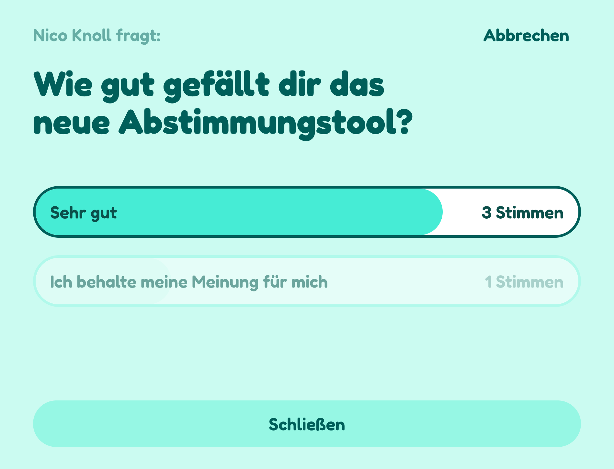

# Voting

A privacy-focused anonymous voting app. Create polls with single or multiple choice options, share them via QR codes or secret links, and track participation in real-time. Anonymity is guaranteed by not storing any connection to voters once they've voted. Results are revealed only when the poll is closed.



## Features

**Poll Creation & Customization:**
- Create polls with unlimited options
- Choose between single-choice or multiple-choice voting
- Select from 21 color schemes (Red, Orange, Amber, Yellow, Lime, Green, Teal, Cyan, Sky, Blue, Indigo, Violet, Purple, Fuchsia, Pink, Rose, Slate, Gray, Zinc, Neutral, Stone)
- Automatic poll lifecycle (auto-close after 7 days, auto-delete after 30 days)

**Sharing & Access:**
- Share via QR codes for easy mobile access
- Secret links (format: `xxx-xxxx-xxx`) allow anyone to vote anonymously
- Direct user invitation from your organization's user list
- Copy-to-clipboard functionality for easy sharing

**Poll Management:**
- Real-time tracking of who has voted vs. who hasn't
- Manual poll closing at any time
- Delete polls when no longer needed
- Creator-only permissions for poll control

**Privacy & Security:**
- Anonymous voting (no voter identity stored after voting)
- Google OAuth authentication for poll creators
- Results visible only after poll is closed
- Access control based on user invitations or secret links

## Tech Stack

**Frontend:**
- React 19 + TypeScript
- Vite
- TailwindCSS 4
- React Router
- React Query (TanStack Query)
- QR Code generation

**Backend:**
- Python 3.11
- DigitalOcean Functions (Serverless)
- Redis

**Authentication:**
- Google OAuth

## Prerequisites

- Node.js (with pnpm)
- Python 3.11
- [uv](https://github.com/astral-sh/uv) (Python package manager)
- Redis (for local development)
- DigitalOcean CLI (`doctl`) for deployment
- `lftp` for FTP deployment (optional)

## Setup

1. **Clone the repository**

```bash
git clone <repository-url>
cd voting
```

2. **Configure environment variables**

Copy the example environment file and fill in your values:

```bash
cp .env.example .env
```

Edit `.env` with your configuration:
- `GOOGLE_CLIENT_ID`: Your Google OAuth client ID
- `REDIS_CONNECTION_STRING`: Redis connection string
- `API_BASE_URL`: Backend API URL
- `FRONTEND_URL`: Frontend URL
- FTP credentials (optional, for deployment)

3. **Install dependencies**

Frontend:
```bash
cd client
pnpm install
```

Backend:
```bash
cd server
uv sync
```

## Development

**Start the frontend:**

```bash
cd client
pnpm dev
```

The frontend will run on `http://localhost:5173`

**Start the backend:**

```bash
cd server
uv run python src/__main__.py
```

The backend will run on `http://localhost:8000`

**Start Redis (if running locally):**

```bash
redis-server
```

## Build and Deploy

The project includes an automated build and deployment script:

**Deploy to production:**

```bash
./build_and_deploy.sh production
```

**Deploy with custom environment:**

```bash
./build_and_deploy.sh <mode>
```

This script will:
1. Build the backend and deploy to DigitalOcean Functions
2. Build the frontend Vite app
3. Upload the frontend via FTP (if credentials are configured)
4. Clean up build artifacts

## Project Structure

```
vote/
├── client/              # React frontend
│   ├── src/
│   │   ├── components/  # Reusable components
│   │   ├── pages/       # Page components
│   │   ├── data/        # API client and types
│   │   └── utils/       # Utilities
│   └── package.json
├── server/              # Python backend
│   ├── src/
│   │   ├── __main__.py  # Main server code (Flask dev server + DO Functions handler)
│   │   └── users.json   # User database
│   └── project.yml      # DigitalOcean Functions config
├── .env.example         # Environment variables template
├── .gitignore
└── build_and_deploy.sh  # Deployment script
```

## API Endpoints

All endpoints require Google OAuth authentication via `Authorization: Bearer <token>` header.

**Users:**
- `GET /api/users` - List all users in the organization

**Polls:**
- `GET /api/polls` - List all polls the authenticated user has access to
- `GET /api/polls/:id` - Get specific poll details (optional `?secret=xxx-xxxx-xxx` query param)
- `POST /api/polls` - Create a new poll
- `DELETE /api/polls/:id` - Delete a poll (creator only)

**Poll Actions:**
- `POST /api/polls/:id/users` - Add users to a poll (creator only)
- `POST /api/polls/:id/vote` - Submit a vote (requires body: `{values: string[], secret?: string}`)
- `POST /api/polls/:id/close` - Close a poll (creator only)

## License

MIT